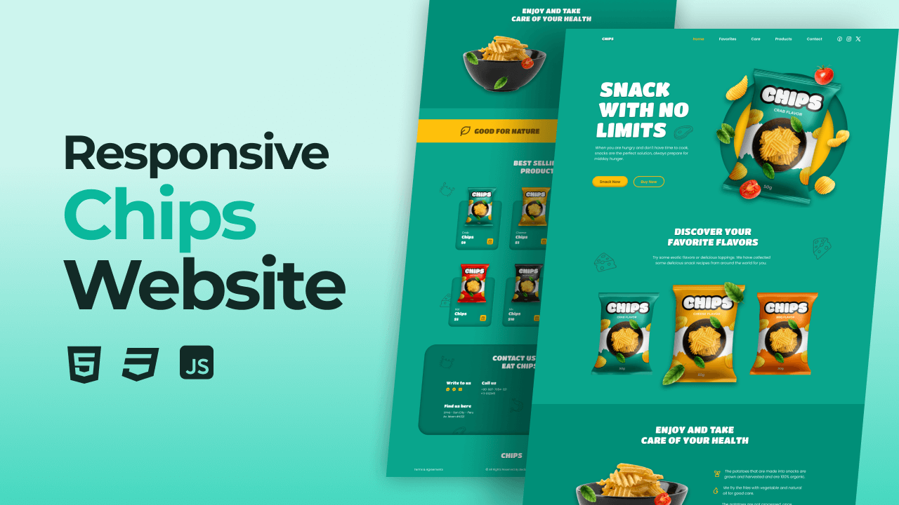

## Table of contents

- [Overview](#overview)
  - [Screenshot](#screenshot)
- [My process](#my-process)
  - [Built with](#built-with)
  - [What I learned](#what-i-learned)
- [Author](#author)

## Overview

### Screenshot




## My process

### Built with

- vite (npm create vite@latest .)
- HTML 5
- SCSS
- JavaScript (Vanilla)

### What I learned

A full responsive and animated homepage for Chips using HTML, SASS, JavaScript and the best practices for WebDeveloper.

```css
:root {
???????
```

## Author

- GitHub - [Nicolas Johnson](https://github.com/Nicolas-Johnson)

